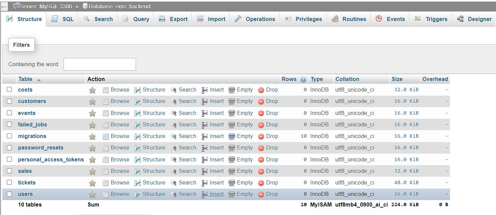
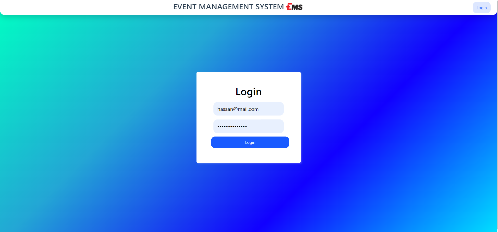
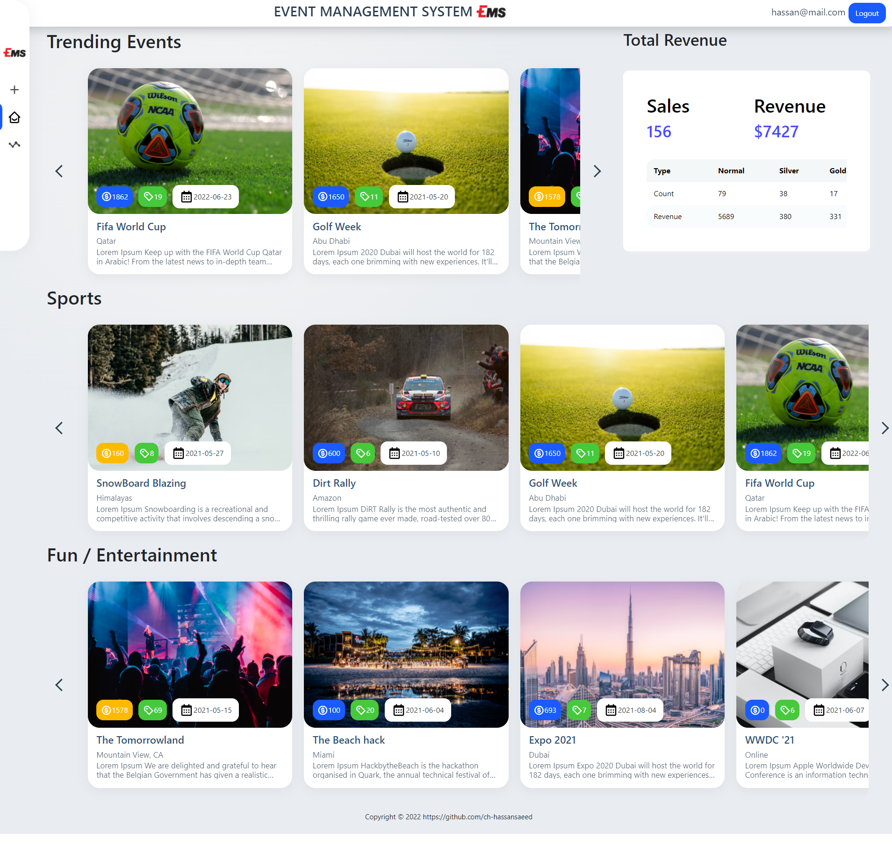
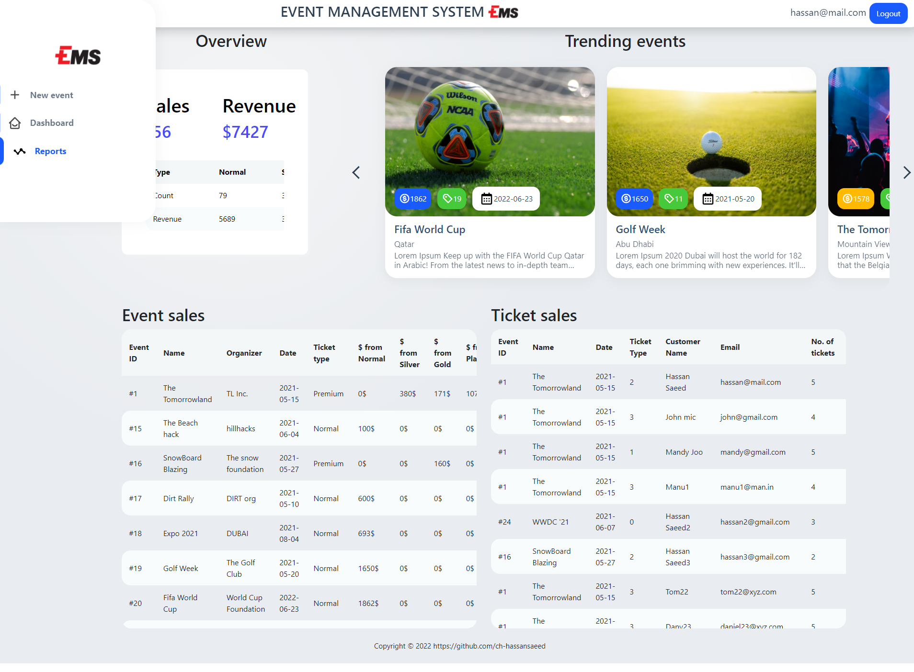
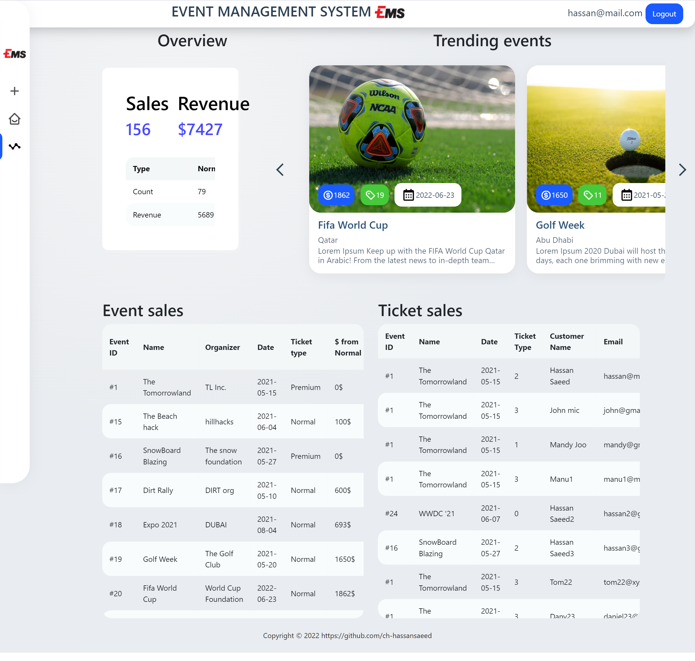
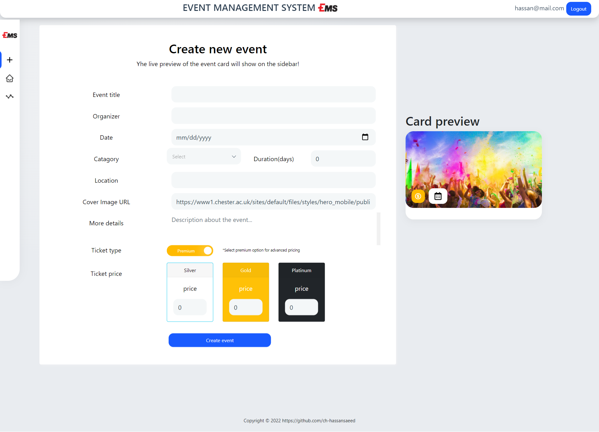
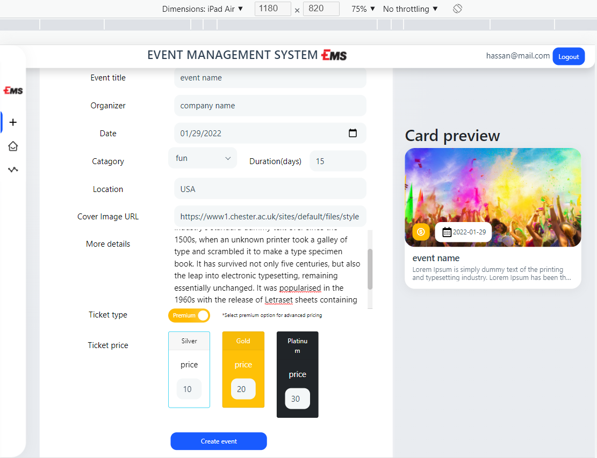
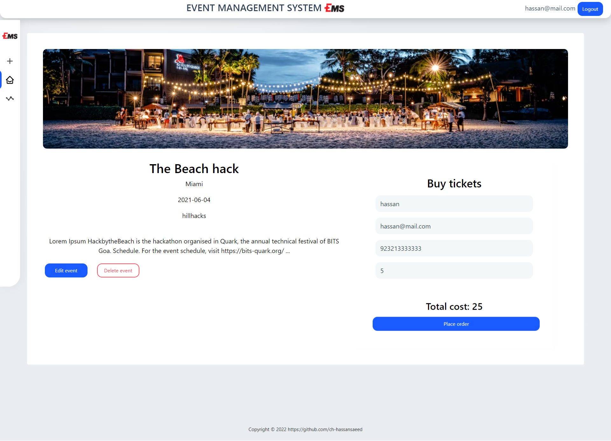
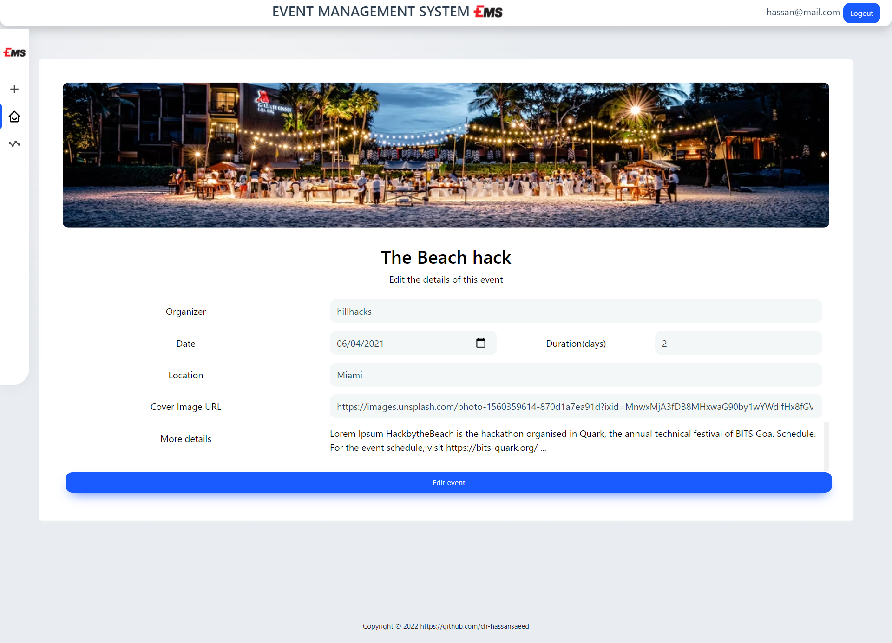
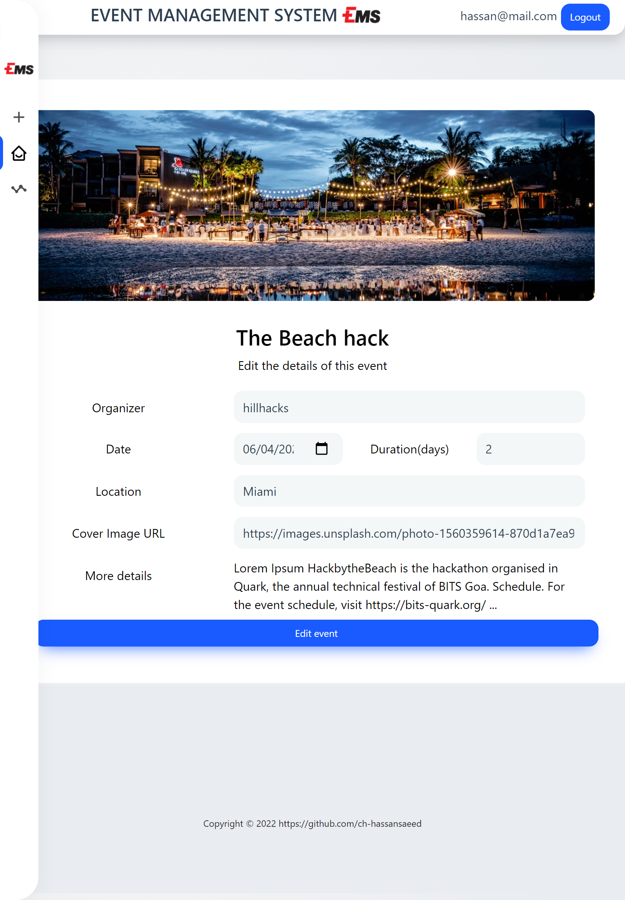

# Event Management system - EMS

A Event Management system - EMS build with Laravel and Vuejs

### Both FE & BE project folders has own README.md files for installation and run method.
ems_backend\README.md \
ems_frontend\README.md 

## Demo Snapshots 
# `Database`

# `Login form`

# `Dashboard`

# `IPAD view`

# `Report Page`

# `IPAD view`

# `Create Event`

# `IPAD view`

# `Event view`

# `Edit Event`

# `IPAD view`

